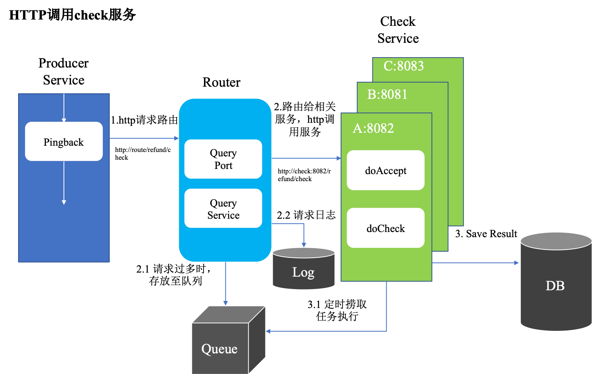

## Phoenix

采用HTTP路由的方式实现业务check服务

- producer：producer service为主要业务逻辑线，通过pingback调用check服务进行校验
- router：pingback请求首先会发给router进行负载均衡，服务映射等操作，然后将请求转发给对应的checker服务
- checker：check service负责对已有业务进行数据校验，接受router转发的数据进行处理，并对校验结果进行保存

*rpc分支是通过dubbo完成服务间调用